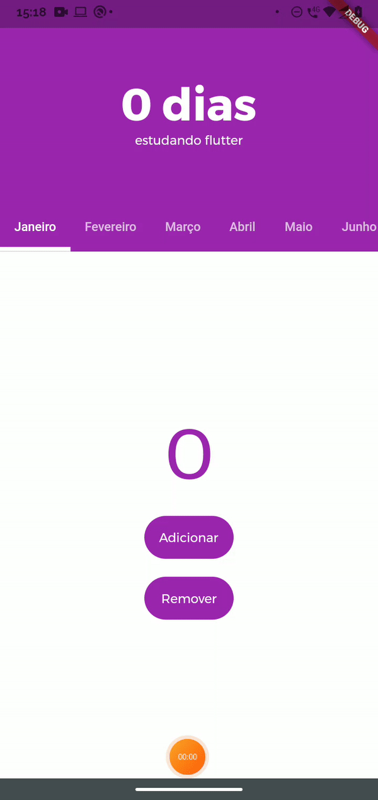

# Contador App
 Um simples contador  para contabilizar  os dias de estudo em Flutter :)
 
 A motivação desse app se deu devido ao fato de, na época de sua construção, eu estar apenas iniciando os estudos em Flutter, portanto eu quis desenvolver algo que pudesse utilizar no meu aparelho e que me motivasse a manter regularidade nos estudos.
 
  

 
 

 
 ## Download do Aplicativo (APK)
Baixe e instale o aplicativo em seu smartphone *Android*:
[Download APK](https://drive.google.com/u/0/uc?id=1wvfmVJIbdcVNF4TPbCxRm4pBHjqDLwI1&export=download)
 
 ## Aprendizado
* Utilização do widget `NestedScrollView`.
* Utilização do widget `SliverAppBar`.
* Utilização do widget `TabBarView`.
* Utilização do widget `ListView.builder`.
* Utilização do `setState`.
* Utilização do plugin `path_provider` para salvar e utilizar arquivos na memória interna do dispositivo.
